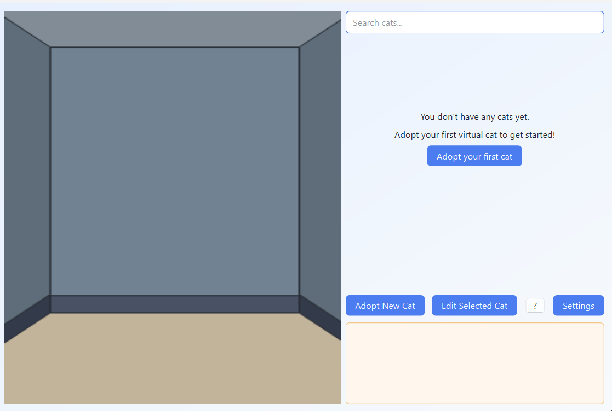
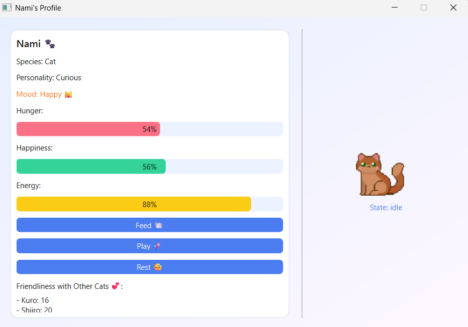

# Virtual Cats (Desktop App)

A small desktop virtual cat app built with **Python** and **PySide6**.  
You can adopt animated pixel-art cats, view their stats, interact with them, and watch them wander around a background scene.

---

## Features

- **Adopt cozy cats**: Create new pixel-art cats with a name, personality, and color.
- **Animated sprites**: Cats are animated from sprite sheets (idle, sleep, play, collapse, more).
- **Room & backgrounds**: Choose from multiple pixel-art room backgrounds via the Settings dialog.
- **Cat management UI**:
  - Searchable cat list with soft health indicators for hunger (🍽️), tiredness (😴), and low happiness (😿).
  - Empty‑state screen that invites you to adopt your **first cat** instead of showing a blank list.
  - Right‑click context menu on a cat (open profile, edit, delete) so destructive actions are tucked away.
- **Stats & mood system**:
  - Track **hunger**, **happiness**, and **energy** for each cat, including auto‑decay over time.
  - See a combined mood label and state (idle, playing, sleeping, collapsed, …).
- **Interactions between cats**:
  - Periodic random interactions based on personality (affectionate, playful, shy, etc.) that change stats and relationships.
  - Story-style log messages appear in the main window describing what happened.
- **Per‑cat profile view**:
  - Dedicated profile window with progress bars, mood, and friendliness toward other cats.
  - Interact directly (Feed / Play / Rest) with cooldowns and personality-flavoured feedback.
- **Clickable scene**:
  - Each on‑screen cat sprite is clickable to open its profile and highlight it in the list.
- **Persistence**:
  - Cats and their relationships are stored in `data/pets.json`.
  - UI config (background selection) is stored in `data/config.json`.

---

## Screenshots




## Project structure

Key files and folders:

- `main.py` – Application entry point; creates the Qt `QApplication` and shows `MainWindow`.
- `ui/main_window.py` – Main window: background scene, cat list, adoption/edit/delete, log, timers, help dialog.
- `ui/add_pet_dialog.py` – Dialog to adopt a new cat (name, personality, color).
- `ui/edit_pet_dialog.py` – Dialog to rename a cat and tweak personality.
- `ui/pet_profile_window.py` – Detailed profile window with stats, mood, interactions, and relationships.
- `ui/settings_dialog.py` – Background picker with thumbnail gallery.
- `ui/pet_sprite.py` – Sprite widget to animate cats from a sprite sheet.
- `pet/pet.py` – `VirtualPet` model class (stats, mood, serialization).
- `pet/interactions.py` – Logic for random cat‑to‑cat interactions and relationship changes.
- `pet/persistence.py` – Load/save cats to `data/pets.json`.
- `pet/config.py` – Load/save simple UI configuration (`data/config.json`).
- `data/` – JSON data for cats and configuration.
- `assets/PetMobileGameAsset/` – Pixel-art assets (backgrounds and cat sprites).

---

## Requirements

- **Python 3.9+** (3.10+ recommended)
- **PySide6** (Qt for Python)

You can install the dependencies with:

```bash
pip install -r requirements.txt
```

If you are on Windows and using PowerShell, you may also want to create and activate a virtual environment:

```powershell
cd path\to\VirtualCats
python -m venv venv
.\venv\Scripts\Activate.ps1
pip install -r requirements.txt
```

---

## Running the app

From the project root:

```bash
python main.py
```

This will launch the main window where you can:

- Adopt new cats via **"Adopt New Cat"**.
- Double‑click a cat in the list or click its sprite in the room to open its profile window.
- Use the **?** button to read a short “How to play” guide.
- Change the background via **Settings → Change Background**.

---

## Data & assets

- **Cats data**: `data/pets.json`  
  - Contains all adopted cats, their stats, and relationships.  
  - You can delete this file to start with a clean slate; it will be recreated automatically.
- **Config**: `data/config.json`  
  - Stores the currently selected background.
- **Assets**: `assets/PetMobileGameAsset/...`  
  - The app expects the backgrounds in `assets/PetMobileGameAsset/Backgrounds/1.png`, `2.png`, …  
  - Cat sprite sheets are expected in `assets/PetMobileGameAsset/Cats/RetroCats/`.

If you are publishing this publicly, make sure you have the right to redistribute any third‑party art assets you include here. If the pixel art is from a specific pack/author, add the appropriate attribution and/or license notes in this section.

---

## License

The **code** in this repository is released under the [MIT License](LICENSE).

- You are free to use, modify, and distribute the code commercially or non‑commercially, as long as you include the MIT copyright and permission notice.
- The license applies **only to the source code**, not to third‑party art assets.

## Art assets attribution

This project uses the **Pet Mobile Pixel Asset Pack** by **ToffeeCraft**, available on itch.io:  
[`https://toffeecraft.itch.io/pet-virtual-mobile-pixel-asset`](https://toffeecraft.itch.io/pet-virtual-mobile-pixel-asset).

- All pixel‑art backgrounds and cat sprites under `assets/PetMobileGameAsset/` come from this pack.
- These assets are used under the pack’s license (personal/commercial use allowed; redistribution or reselling of the raw assets is not permitted).  
- The MIT license for the code **does not grant any rights** to reuse or redistribute these art assets independently of this project. Please obtain them directly from the author if you want to use them in your own game.